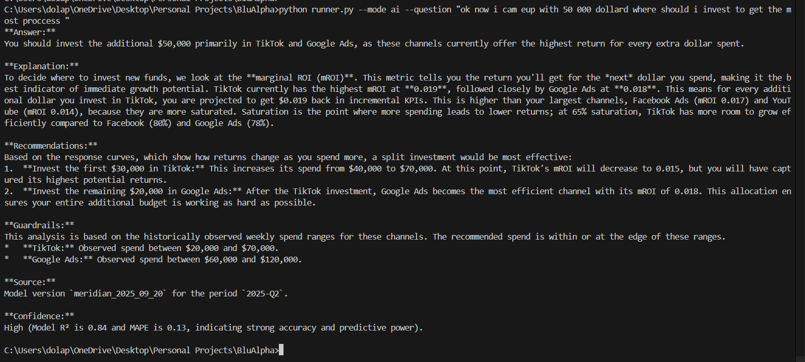

# MMM AI Interpretation Layer

## Overview
This is an AI-powered assistant that translates complex Marketing Mix Model (MMM) outputs into plain-English, actionable insights for marketers. It answers "what" and "why" questions about channel performance.

## Features
*   **Question Answering:** Ask any question about channel performance (e.g., "Why is TikTok underperforming?").
*   **Data-Driven Insights:** Answers are grounded in model data (ROI, mROI, adstock, saturation).
*   **Actionable Recommendations:** Provides clear, justifiable budget allocation advice.
*   **REST API:** Fully integrated with a FastAPI server for easy integration with other tools.

## Tech Stack
*   **AI:** Google Gemini API
*   **Backend Framework:** FastAPI (Python)
*   **Data:** JSON-based model output

## Current Status (Under Active Development)
*   **Phase 1 (AI Interface):** ✅ **COMPLETE** - The core AI answering engine is fully functional.
*   **Phase 0 (Data Pipeline):** 🚧 **BLOCKED** - Awaiting access to the correct model library to generate data from the `.pkl` file.

## Installation & Setup
1.  **Clone the repository**
2.  **Install dependencies:** `pip install -r requirements.txt`
3.  **Set your API key:** Create a `.env` file with `GEMINI_API_KEY=your_key_here`

## How to Run
**1. Command-Line Testing:**
```bash
# Test the AI
python runner.py --mode ai --name "Google Ads" --question "What is the ROI?"
# Get the best channel
python runner.py --mode best



